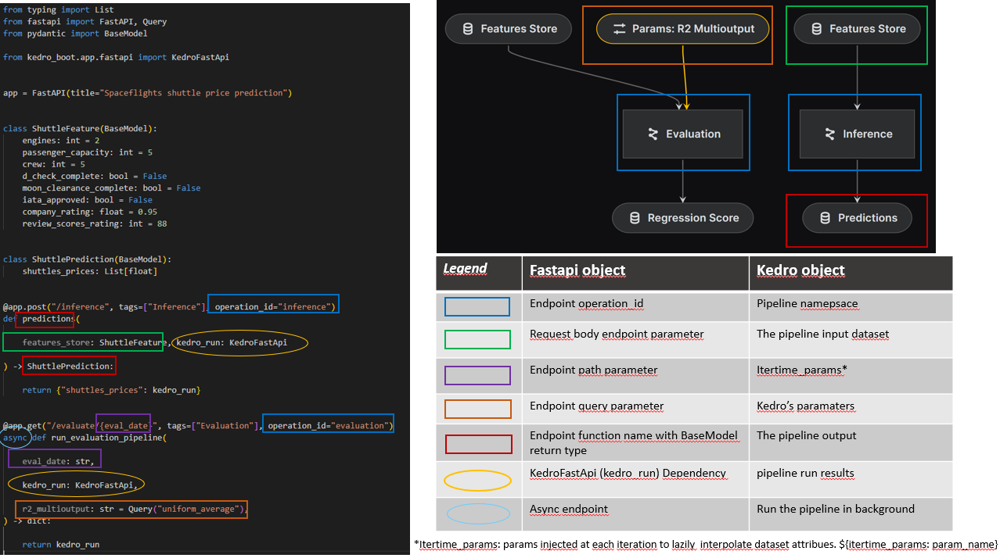
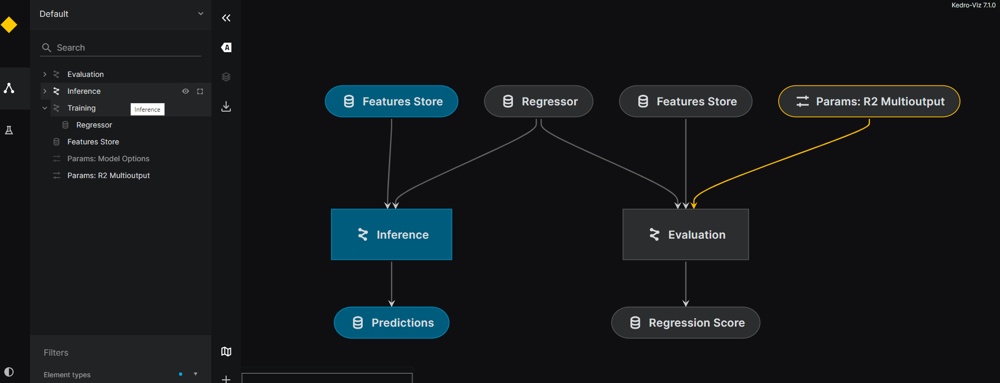

[](https://pypi.org/project/kedro/)
[](https://badge.fury.io/py/kedro-boot)
[](https://github.com/takikadiri/kedro-boot/blob/main/LICENSE)
[](https://kedro.org)

# What is kedro-boot ?
Kedro Boot simplifies the integration of your Kedro pipelines with any applications. It's a framework for creating APIs and SDKs for your Kedro projects.
It offers these key functionalities: 

- :syringe: **Data injection**: Streamline the process of feeding data from any application into Kedro pipelines.
- :zap: **Low-Latency**: Execute multiple pipeline runs with minimal delay with optimisation for time-sensitive web applications.

This enables using Kedro pipelines in a wide range of use cases, including model serving, data apps (streamlit, dash), statistical simulations, parallel processing of unstructured data, streaming...  It also streamlines the deployment of your Kedro pipelines into various Data & AI Platforms (e.g. Databricks, DataRobot...).

_If you're new to [kedro](https://github.com/kedro-org/kedro), we invite you to visit [kedro docs](https://docs.kedro.org/en/stable/)_

# How do I use Kedro Boot ?

Any application can consume kedro pipelines through REST APIs or as a library (SDK). ``kedro-boot`` provides utilities and abstractions for each of these integration patterns. 

## Getting started

### Use case 1 : The standalone mode - How to run a kedro pipeline from another application

In this section, we assume you want to trigger the run of a kedro pipeline from another application which holds the entry point. This refer to applications that have their own CLI entry points (e.g. ``streamlit run``) and cannot be embedded in kedro's entry point (e.g. you cannot open streamlit with ``kedro run``). Low code UI (Streamlit, Dash...) and Data & AI Platforms are examples of such applications.

> [!IMPORTANT]  
> The 1st key concept of ``kedro-boot`` is the ``KedroBootSession``. It is basically a standard ``KedroSession`` with 2 main differences: 
> - you can run the same session multiple times with many speed optimisation (including dataset caching)
> - you can pass data and parameters at runtime : ``session.run(inputs={"your_dataset_name": your_data}, itertime_params={"my_param": your_new_param})`` 

The ``KedroBootSession`` should be created with either ``boot_project`` or ``boot_package`` (if the project as been previously packaged with ``kedro package``). A basic example would be the following:

```python
from kedro_boot.app.booter import boot_project
from kedro_boot.app.booter import boot_package
from kedro_boot.framework.compilation.specs import CompilationSpec

session = boot_project(
    project_path="<your_project_path>",
    compilation_specs=[CompilationSpec(inputs=["your_dataset_name"])], # Would be infered if not given
    kedro_args={ # kedro run args
        "pipeline": "your_pipeline", # IMPORTANT : You must create one KedroBootSession per pipeline, except for namespaced pipelines
        "conf_source": "<your_conf_source>",
    },
)

# session = boot_package(
#     package_name="<your_package_name>",
#     compilation_specs=[CompilationSpec(inputs=["your_dataset_name"])],
#     kedro_args={
#         "pipeline": "your_pipeline",
#         "conf_source": "<your_conf_source>",
#     },
# )

run_results = session.run(inputs={"your_dataset_name": your_data})
run_results2 = session.run(inputs={"your_dataset_name": your_data2})
```

You can found a complete example of a steamlit app that serve an ML model in the [Kedro Boot Examples](examples/README.md#data-app-with-streamlit-standalone-mode) project. We invite you to test it to gain a better understanding of Kedro Boot's ``boot_project`` or ``boot_package`` interfaces. 

> [!TIP]  
> The ``CompilationSpec`` gives you advanced control on how to configure the behaviour (which dataset to preload and cache, which arguments to pass on each iteration...). See [the documentation]() for more details. 

### Use case 2 : The embedded mode - Launching an application within kedro

> [!IMPORTANT]  
> The 2nd key concept of ``kedro-boot`` is the ``KedroBootApp`` which is an implementation of the ``AbstractKedroBootApp``. When used inside a kedro project, this class automatically creates a ``KedroBootSession``  which is passed to a ``_run``  abstract method. You can inherit from it to customize the way the way your pipeline is ran (e.g. running it mulitple times) or to start an application inside a kedro run (e.g. serve the pipeline as API) .

This mode involves using ``kedro-boot`` to embed an application inside a Kedro project, leveraging kedro's entry points, session and config loader for managing application lifecycle. It's suitable for use cases when the application is lightweight and owned by the same team that developed the kedro pipelines.

Hereafter is an example of a ``KedroBootApp`` on how to loop over a pipeline for a given number of iterations passed trhough a config file 

```python
from kedro_boot.app import AbstractKedroBootApp
from kedro_boot.framework.session import KedroBootSession


class KedroBootApp(AbstractKedroBootApp):
    def _run(self, kedro_boot_session: KedroBootSession):
        # leveraging config_loader to manage app's configs
        my_app_configs = kedro_boot_session.config_loader[
            "my_app"
        ]  # You should delcare this config pattern in settings.py

        for _ in my_app_configs.get("num_iteration"):  # Doing mutliples pipeline runs
            kedro_boot_session.run(
                namespace="my_namespace",
            )
```

The Kedro Boot App could be declared either in kedro's ``settings.py`` or as ``kedro boot`` run CLI args :

- Declaring ``KedroBootApp`` through ``settings.py``

```python
from your_package.your_module import KedroBootApp

APP_CLASS = KedroBootApp
APP_ARGS = {} # Any class init args
```

The Kedro Boot App could be started with:

```
kedro boot run <kedro_run_args>
````

- Declaring Kedro Boot App through kedro boot run CLI (Take precedence)

```
kedro boot run --app path.to.your.KedroBootApp <kedro_run_args>
````

You can find an example of a [Monte Carlo App embedded into a kedro project](examples/README.md#monte-carlo-simulation-embeded-mode).

## Advanced use cases

### Consuming Kedro pipeline through REST API

``kedro-boot`` implements natively some ``KedroBootApp`` as described in [use case 2](#the-embedded-mode-launching-an-app-from-kedro).

You can serve your kedro pipelines as a REST API using kedro-boot FastAPI Server

First you should install kedro-boot with fastapi extra dependency
```
pip install kedro-boot[fastapi]
````

Then you can serve your fastapi app with :

```
kedro boot fastapi --app path.to.your.fastapi.app <kedro_run_args>
```

Your fastapi app objects will be mapped with kedro pipeline objects, and the run results will be injected into your KedroFastAPI object through [FastAPI dependency injection](https://fastapi.tiangolo.com/tutorial/dependencies/). Here is an illustration of the kedro <-> fastapi objects mapping: 



A default FastAPI app is used if no FastAPI app given. It would serve a single endpoint that run in background your selected pipeline

```
kedro boot fastapi <kedro_run_args>
```

These production-ready features would be natively included in your FastAPI apps:

- Embedded [Gunicorn web server](https://gunicorn.org/) (only for Linux and macOS)
- [Pyctuator](https://github.com/SolarEdgeTech/pyctuator) that report some service health metrology and application states. Usually used by service orchestrators (kubernetes) or monitoring to track service health and ensure it's high availability
- Multiple environments configurations, leveraging kedro's ``OmegaConfigLoader``. ``["fastapi*/"]`` config pattern could be used to configure the web server. Configs could also be passed as CLI args (refer to ``--help``)

You can learn more by testing the [spaceflights Kedro FastAPI example](examples/README.md#rest-api-with-kedro-fastapi-server) that showcases serving multiples endpoints operations that are mapped to differents pipeline namespaces.


## Consuming Kedro pipelines through SDK

Any python applications could consume kedro pipeline as a library. The integration process involves two steps:

- Registring kedro pipeline
- Creating a ``KedroBootSession``

### Registring Kedro pipelines

Kedro Boot prepare the catalog for the application consumption through a compilation process that follow a compilation specs. 

Compilation specs defines the namespaces and their datasets (inputs, outputs, parameters) that would be exposed to the application. It specify also if artifacts datasets should be infered during the compilation process (*artifacts datasets are loaded in ``MemoryDataset`` at runtime in order to speed up iteration time*)

The compilation specs are either given by the Application or infered from the Kedro Pipeline. 

Here is an example of registring a pipeline that contains inference and evaluation namespaces:

```python
# create inference namespace. All the inference pipeline's datasets will be exposed to the app, except "regressor" and "model_options.
inference_pipeline = pipeline(
    [features_nodes, prediction_nodes],
    inputs={"regressor": "training.regressor"},
    parameters="model_options",
    namespace="inference",
)
# create evaluation namespace. All the evaluation pipeline's datasets will be exposed to the app, except "feature_store", "regressor" and "model_options.
evaluation_pipeline = pipeline(
    [model_input_nodes, prediction_nodes, evaluation_nodes],
    inputs={"features_store": "features_store", "regressor": "training.regressor"},
    parameters="model_options",
    namespace="evaluation",
)

spaceflights_pipelines = inference_pipeline + evaluation_pipeline

return {"__default__": spaceflights_pipelines}
```

In this example, all the namespaces and ther namespaced datasets (inputs, outputs, parameters) would infer compilation specs and therefore would be exposed to the ``KedroBootApp``. 

You can use kedro-viz to visualize the datasets that woulc be exposed to the kedro boot apps. In the figure below, for the ``inference`` namespace, we see clearly that ``inference.feature_store`` and ``inference.predictions`` will be exposed to the applicaton (the blue one).



Below are the differents categories of datasets that forms the compiled catalog.

- Inputs: inputs datasets that are be injected by the app at iteration time.
- Outputs: outputs dataset that hold the run results.
- Parameters: parameters that are injected by the app at iteration time.
- Artifacts: artifacts datasets that are materialized (loaded as ``MemoryDataset``) at startup time.
- Templates: template datasets that contains ``${itertime_params: param_name}``. Their attributes are interpolated at iteration time. 

You can compile the catalog without actually using it in a Kedro Boot App. This is helpful for verifying if the expected artifacts datasets are correctly infered or if the template datasets are correctly detected. Here is an example of the catalog compilation report for a pipeline that contains an ``inference`` namespace.

```
kedro boot compile
```
Compilation results:
```
INFO  catalog compilation completed for the namespace 'inference'. Here is the report:                                                          
    - Input datasets to be replaced/rendered at iteration time: {'inference.features_store'}
    - Output datasets that hold the results of a run at iteration time: {'inference.predictions'}
    - Parameter datasets to be replaced/rendered at iteration time: set()
    - Artifact datasets to be materialized (preloader as memory dataset) at startup time: {'training.regressor'}
    - Template datasets to be rendered at iteration time: set()
		
INFO  Catalog compilation completed.           
```

We can see that the ``training.regressor`` is being infered as artifact, it will be loaded as memory dataset to speed up iterations and prevent memory leak in a web app use case.

Note that when infering compilation specs, a pipeline that have no namespaces is also exposed to the kedro boot apps (have a compilation spec), but does not expose any datasets. Applications could provide their own compilation specs in order to specify the datasets that are needed to be exposed.

## Why does Kedro Boot exist ?

Kedro Boot unlock the value of your kedro pipelines by giving you a structured way for integrating them in a larger application. We developed kedro-boot to achieve the following: 

- Streamline deployment of kedro pipelines in batch, streaming and web app context.
- Encourage reuse and prevent rewriting pipeline's logic by the team that own the front application
- Leverage kedro's capabilities for business logic separation and authoring
- Leverage kedro's capabilities for managing an application lifecycle

Kedro Boot apps utilize Kedro's pipeline as a means to construct and manage business logic and some part or I/O. Kedro's underlying principles and internals ensure the maintainability, clarity, reuse, and visibility (kedro-viz) of business logic within Kedro Boot Apps, thanks to Kedro's declarative nature.

## Where do I test Kedro Boot ?

You can refer to the [Kedro Boot Examples](examples) project; it will guide you through four examples of Kedro Boot usages.

## Can I contribute ?

We'd be happy to receive help to maintain and improve the package. Any PR will be considered.