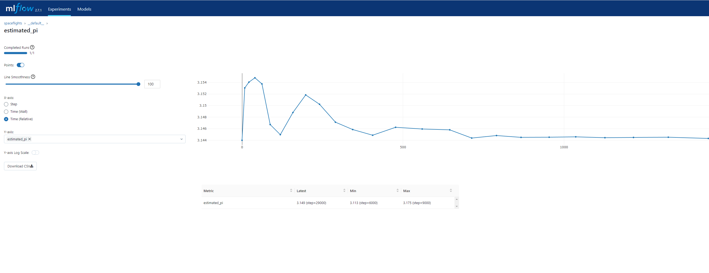

# Kedro Boot Examples

In this tutorial, we construct pipelines and applications for a price-prediction model to illustrate the steps of a typical [Kedro Boot](https://github.com/takikadiri/kedro-boot) workflow.

_It is 2160, and the space tourism industry is booming. Globally, thousands of space shuttle companies take tourists to the Moon and back. You have been able to source data that lists the amenities offered in each space shuttle, customer reviews, and company information._

Project: You want to construct a model that predicts the price for each trip to the Moon and the corresponding return flight. The model need to be deployed in a REST API and in a Data App.

In addition, this project offers a bonus tutorial on using [Kedro Boot](https://github.com/takikadiri/kedro-boot) to conduct a Monte Carlo simulation for estimating Pi and tracking the simulation's progress using [kedro-mlflow](https://github.com/Galileo-Galilei/kedro-mlflow) hooks.

If you're new to [kedro](https://github.com/kedro-org/kedro), we invite you to visit [kedro docs](https://docs.kedro.org/en/stable/)

## Install the project

To install the project and its dependencies, run pip install command in a virtual environment :

```
pip install src/.
````

## Data preparation and model training

You can begin by feeding the features-store using ``data_processing`` pipeline. 

```
kedro run --pipeline data_processing
```

Then you need to train a regressor using features-store data.

```
kedro run --pipeline training
```

## Model deployment

In order to use kedro pipelines into an kedro boot application. We need to registrer an ``AppPipeline`` by using ``app_pipeline`` factory.  
Here we register an ``AppPipeline`` containing inference and evaluation pipelines

```python
# create inference and evaluation app pipeline with an applicatif view on top of them
inference_app_pipeline = app_pipeline(
    inference_pipeline,
    name="inference",
    inputs="features_store",
    artifacts="training.regressor",
    outputs="inference.predictions",
)
evaluation_app_pipeline = app_pipeline(evaluation_pipeline, name="evaluation")

# concatenate spaceflights app pipelines
spaceflights_app_pipelines = inference_app_pipeline + evaluation_app_pipeline

return {"__default__": spaceflights_app_pipelines}
```

### Rest API with FastAPI

The FastApi app is integrated into kedro project in an [embedded mode](https://github.com/takikadiri/kedro-boot#embedded-mode--model-serving-with-fastapi). It serve two endpoints :

- /predict : take the shuffle features, run the inference pipeline and get the prediction results
- /evaluate : trigger the evaluation pipeline, at each run it save the evaluation results in ``data/07/model_output/regression_score_[[ eval_date ]].json`` eval_date is rendered at iteration time.

You can start the FatApi App by running : 

```
kedro boot --app spaceflights_fastapi.app.FastApiApp
```

Then go to http://localhost:8000/docs for trying out your FastAPi App.


The uvicorn (web server) args can be updated using conf/base/fastapi.yml

### Data App with Streamlit

The Streamlit app consume kedro project in a [standalone mode](https://github.com/takikadiri/kedro-boot#standalone-mode--data-app-with-streamlit).

You can start the Streamlit App by running : 

```
streamlit run src/spaceflights_streamlit/app.py
```

Streamlit typically opens your Streamlit app in a new browser tab. If it doesn't, you can obtain the local URL from the terminal. 
You can try the app by modifying the shuttle features and calculating the associate prediction.


## Bonus example : Monte Carlo Simulation

In this example we'll estimate Pi using monte carlo simulation. This demonstrates how to utilize [Kedro Boot](https://github.com/takikadiri/kedro-boot) in a [dynamic pipeline](https://github.com/kedro-org/kedro/issues/2627) scenario. The monte carlo app perform multiple pipeline runs and compose the pipelines dynamically at runtime.

You can configure the app using ``conf/base/monte_carlo.yml`` and start it by running : 

```
kedro boot --app monte_carlo_pi.app.MonteCarloApp --pipeline monte_carlo
```

You can disable logs using logging.yml to speed up simulation.  

[kedro-mlflow](https://github.com/Galileo-Galilei/kedro-mlflow) hooks is used under the hood to track Pi estimation at each iteration setp. You can start the UI by running ``kedro mlflow ui``




